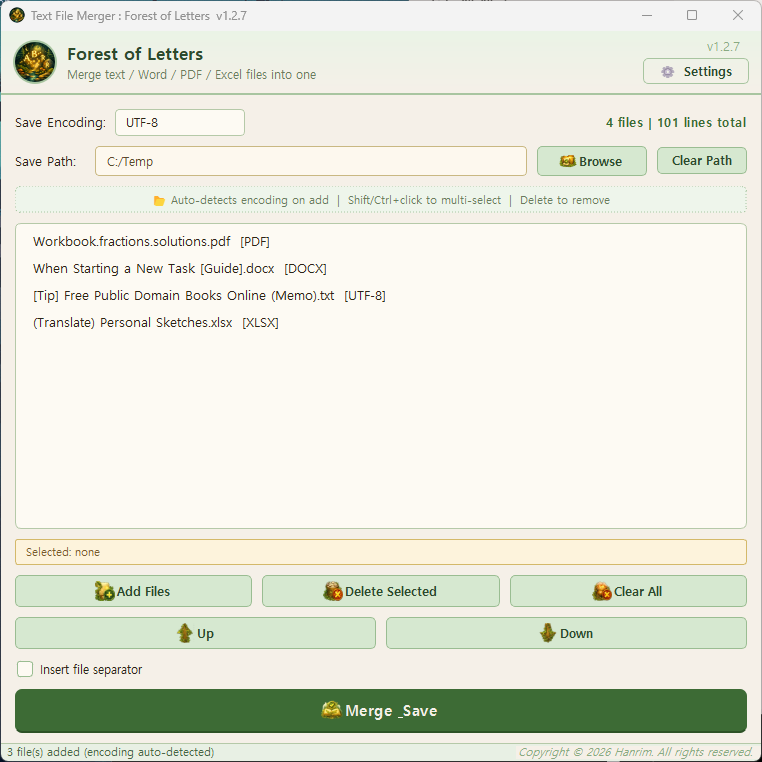
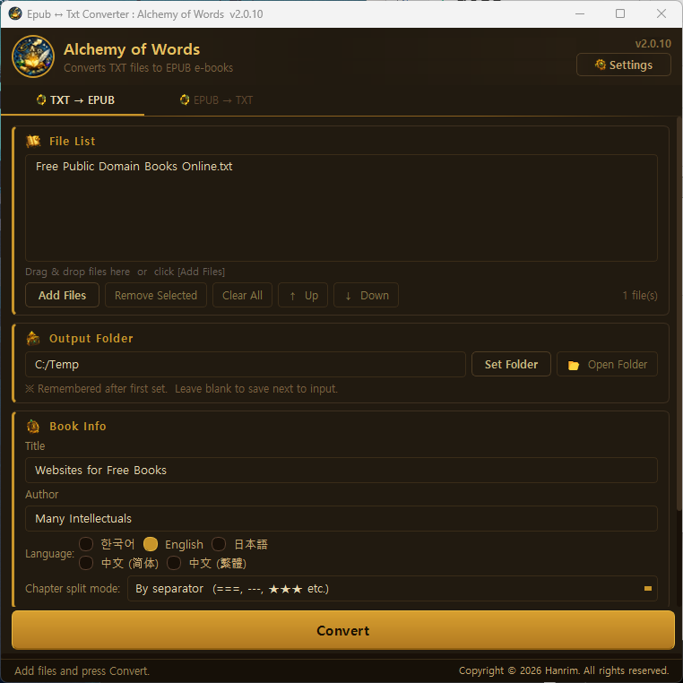
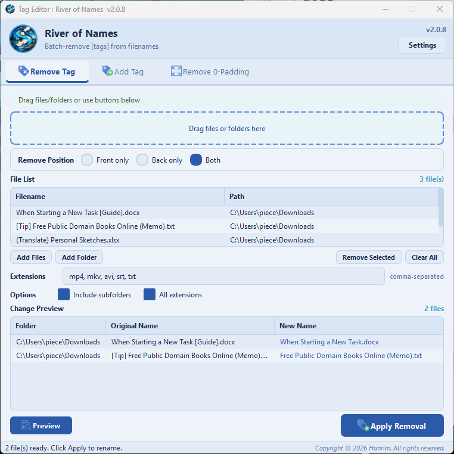
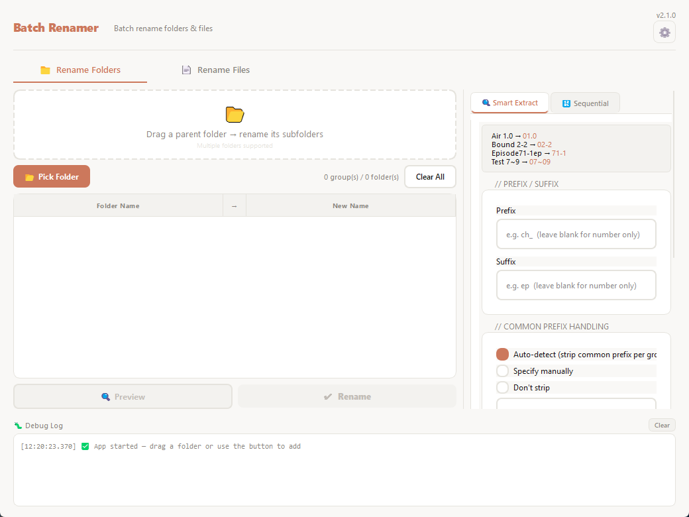
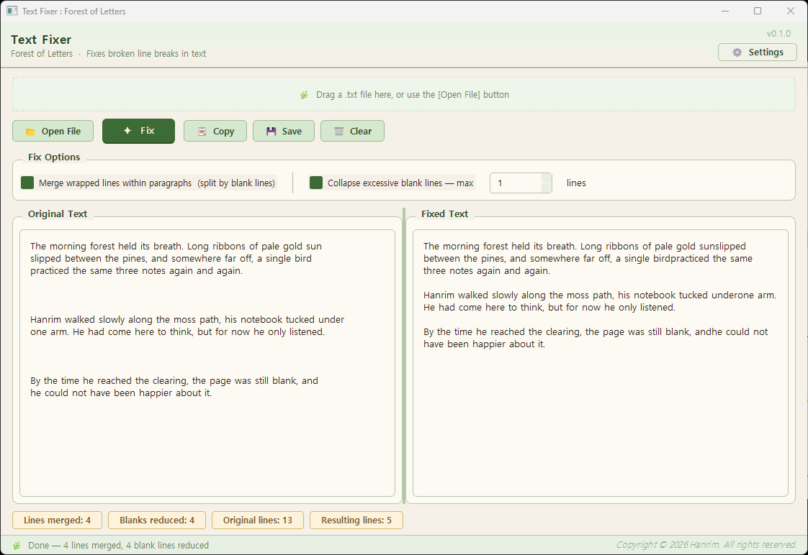

<div align="center">

# File Nexus Suite

**통합 파일 관리 도구 · Integrated File Utility**

텍스트 병합 · EPUB 변환 · 파일명 태그 편집 · 일괄 이름 변경 · 줄바꿈 교정

<br>


-7B6FA3?style=flat-square)


<br>

[](https://github.com/MerciHanrim/FileNexusSuite/releases/latest)

[Report Bug](https://github.com/MerciHanrim/FileNexusSuite/issues) · [Request Feature](https://github.com/MerciHanrim/FileNexusSuite/issues)

</div>

---

## 프로젝트 소개 · About

File Nexus Suite는 일상적인 파일 작업을 하나의 데스크톱 애플리케이션에 통합한 Windows용 도구입니다. 텍스트 파일 병합, EPUB/TXT 상호 변환, 파일명 태그 편집, 폴더·파일 일괄 이름 변경, 텍스트 줄바꿈 교정까지 — **6개의 핵심 기능을 일관된 UI로 제공**합니다.

> File Nexus Suite integrates everyday file tasks into a single Windows desktop application — text merging, EPUB conversion, filename tag editing, batch renaming, and line-break correction — all with a consistent UI.

### 개발 방식 · Development Approach

본 프로젝트는 **AI 페어 프로그래밍(Claude)으로 개발**되었습니다. [Hanrim](https://github.com/MerciHanrim)이 기획·UX 설계·기능 명세·품질 관리를 담당하고, 코드 작성은 AI와 협업하여 진행했습니다. 전체 소스 코드는 본 저장소에 공개되어 있어 자유롭게 검토·학습할 수 있습니다.

> This project was developed with **AI pair programming (Claude)**. Planning, UX design, feature specification, and quality management were done by Yongwoo Shin (Hanrim), with code written in collaboration with AI. The full source code is published in this repository for open review and study.

---

### 시작 동기 · Origin

처음에는 통합 도구가 아니었습니다. 텍스트 병합 도구 **Forest of Letters**(활자의 숲), 전자책 변환 도구 **Alchemy of Words**(언어 연금술), 파일명 정리 도구 **River of Names**(흐르는 이름의 강), 폴더·파일 일괄 이름 변경 도구 **Folder & File Batch Renamer**, 그리고 줄바꿈 교정 도구 **Text Fixer**(Garden of Lines, 줄의 정원) — 이런 식으로 제작자가 개인적으로 쓰던 단일 기능 도구들이 어느새 5개로 늘어 있었습니다.

각각의 도구는 독립적인 정체성·테마·버전 체계를 가지고 일상에 자리잡았지만, 매번 다른 창을 띄우고 다른 단축키를 외우고 다른 출력 폴더를 설정하는 번거로움이 점점 커졌습니다. Folder & File Batch Renamer를 만들면서 처음 시도한 테마 카드와 컬러 시스템이 통합 도구의 시각적 정체성으로 자리잡을 수 있겠다는 확신도 더해졌고, "하나로 통합하면 어떨까?" 라는 생각에서 File Nexus Suite가 시작되었습니다. 검증된 각 도구의 코어 로직을 한 지붕 아래로 모으고, PyQt5에서 PySide6(Qt 6)로 프레임워크를 현대화하는 작업이 진행되었습니다.

통합 과정에서 예상하지 못한 부수 효과도 있었습니다. Text Fixer가 다른 도구들과 같은 지붕 아래 들어오자 "이걸 한 파일씩이 아니라 폴더 단위로 일괄 처리하면 어떨까?" 라는 생각이 자연스럽게 떠올랐고, 그렇게 **Bulk Fixer**라는 새 탭이 통합 도구 안에서 새로 만들어졌습니다. 통합이 단순히 도구를 모으는 것을 넘어, 새로운 기능이 자랄 수 있는 토양이 되어준 셈입니다.

같은 워크플로우의 불편을 겪던 다른 사용자, 그리고 한국어 외의 언어를 사용하는 사용자에게도 같은 가치를 전하고 싶어 5개 언어로 공개합니다.

> File Nexus Suite didn't begin as a suite. It grew out of five standalone utilities the author had built and used personally over time: *Forest of Letters* (text merging), *Alchemy of Words* (e-book conversion), *River of Names* (filename tag editing), *Folder & File Batch Renamer*, and *Text Fixer* (Garden of Lines). Each tool matured independently with its own identity, theme, and versioning. The friction of launching them separately — different windows, different shortcuts, different output folders — combined with a growing conviction that the theme-card pattern and color system first prototyped in the renamer could carry an integrated tool's visual identity, made consolidation the obvious next step. The codebases were unified and modernized from PyQt5 to PySide6 (Qt 6) along the way. An unexpected bonus emerged during integration: once Text Fixer sat alongside the other tools, the question "what if this ran on a whole folder at once?" arose naturally, and **Bulk Fixer** was born as a new tab inside the suite. Consolidation turned out to be more than gathering tools — it became fertile ground for new features to grow. The integrated suite is published in 5 languages so users facing the same friction, in any language, can benefit.

<details>
<summary>📸 통합 이전의 5개 독립 프로그램 · The 5 standalone predecessors</summary>

<br>

| 원본 프로그램 · Original Program | 통합 후 탭 · Integrated as |
|:---|:---|
| <br>**Forest of Letters** (활자의 숲) v1.2.7 | Text Merger |
| <br>**Alchemy of Words** (언어 연금술) v2.0.10 | Text Converter |
| <br>**River of Names** (흐르는 이름의 강) v2.0.8 | Tag Editor |
| <br>**Folder & File Batch Renamer** v2.1.0<br>(File Nexus Suite의 테마 카드·9개 컬러 테마 시스템이 처음 시도된 도구) | Batch Renamer |
| <br>**Text Fixer** (Garden of Lines, 줄의 정원) v0.1.0 | Text Fixer |

각 프로그램은 PyQt5 기반 독립 도구로 운영되다가 PySide6로 마이그레이션되며 File Nexus Suite로 통합되었습니다. **Bulk Fixer**는 5개 독립 도구에 더해 통합 과정에서 새로 만들어진 기능입니다.

> Each program ran as a standalone PyQt5 tool before being migrated to PySide6 and consolidated into File Nexus Suite. The Folder & File Batch Renamer also contributed the theme-card pattern and the 9-color theme system that defines File Nexus Suite's visual identity today. **Bulk Fixer** was added later as a new feature born from the integration itself.

</details>

---

## 이런 분께 추천합니다 · Recommended For

- ✍️ **장편 원고를 집필 중인 작가** — 챕터별로 흩어진 파일을 한 권의 EPUB으로 정리
- 📜 **저작권 만료 고전을 정리하는 독자** — 구텐베르크 프로젝트, 위키문헌 텍스트를 리더용으로 가공
- 🌐 **다국어 텍스트 자료를 다루는 번역가·연구자** — 다양한 인코딩의 파일을 자동 감지하여 안전하게 처리
- 📝 **회의록·기술 문서를 정리하는 직장인** — 여러 .txt 노트를 한 문서로 병합
- 🎓 **강의 노트·연구 자료를 정리하는 학생·연구자** — 흩어진 메모를 한 권의 참고 자료로
- 🗂️ **여러 파일을 일괄적으로 다루는 일반 사용자** — 파일명 규칙화, 태그 정리

> Recommended for: writers organizing chapter drafts into EPUBs · readers curating public-domain classics · translators and researchers handling multilingual texts in various encodings · professionals consolidating meeting notes · students compiling study materials · anyone managing files in bulk.

---

## 안전 설계 · Safety by Design

파일을 변경하는 도구는 본질적으로 데이터 손실 리스크를 가집니다. File Nexus Suite는 이를 인식하고 **두 가지 메타 원칙**을 모든 탭에 일관되게 적용합니다.

### 메타 원칙 · Meta Principles

- 🔍 **미리보기 우선 (Preview First)** — 모든 파괴적 작업은 실행 전 변경 전후를 확인할 수 있습니다.
- ↩️ **실행 취소 필수 (Undo Required)** — 이름 변경, 태그 편집, 병합 등 파일 변경 작업에 실행 취소를 제공합니다.

### 변환 도구의 추가 안전 설계 · Additional Safety for File-Generating Tools

Text Fixer / Bulk Fixer / Text Converter처럼 **새 파일을 생성하는 도구**는 추가 보호 계층을 가집니다:

- 🛡️ **원본 무손상** — 출력 폴더 지정 시 원본 파일은 손대지 않습니다. 안전성 강화를 위해 원본 덮어쓰기 옵션은 의도적으로 제거되었습니다.
- 🏷️ **결과물 식별** — 변환된 파일은 `[Fixed]` 등의 접두사로 자동 표시되어 검수해야 할 파일임을 알립니다.
- 📁 **출력 경로 분리** — `Output/` 폴더로 결과물을 모아 원본과 명확히 분리합니다.

### Text Fixer ↔ Bulk Fixer 권장 워크플로우 · Recommended Workflow

일괄 처리는 알고리즘 결함이 다수 파일로 확산될 수 있는 본질적 리스크가 있어, 다음 흐름을 권장합니다:

1. **Text Fixer**에서 단일 파일로 변환 결과를 충분히 검증
2. 동일 알고리즘으로 안심하고 **Bulk Fixer** 일괄 적용
3. Output 폴더의 `[Fixed]` 결과물 검수
4. **Tag Editor** 탭에서 `[Fixed]` 태그 일괄 제거하여 정리 완료

이 흐름은 사용자가 일괄 처리 결과를 항상 한 번 거쳐가도록 자연스럽게 유도합니다.

> File Nexus Suite applies two meta-principles consistently across every tab: *preview first* (all destructive actions show before/after) and *undo required* (file-changing operations support undo). File-generating tools (Text Fixer, Bulk Fixer, Text Converter) add three more layers: originals stay untouched when an output folder is specified (the "overwrite original" option was intentionally removed for safety), results carry an identifier prefix (e.g. `[Fixed]`), and `Output/` keeps results visually separated. Recommended path for batch use: validate on one file with Text Fixer → run Bulk Fixer with confidence → review `[Fixed]` files → strip the prefix in Tag Editor.

---

## 주요 특징 · Highlights

- 🗂️ **6 Integrated Tabs** — Text Merger, Text Converter, Tag Editor, Batch Renamer, Text Fixer, Bulk Fixer
- 🎨 **9 Themes + Auto Mode** — Light, Dark, Sakura, Choco, Mint, Ocean, Sand, Honey, Lavender (+ OS dark mode detection)
- 🌐 **5 Languages** — 한국어 · English · 日本語 · 简体中文 · 繁體中文 (auto-detected from OS)
- 🛡️ **Safe by Design** — Preview before apply + Undo support for every destructive action
- 🎯 **Drag & Drop Everywhere** — Every tab accepts file/folder drag & drop
- 💾 **Smart Encoding** — Auto-detect with chardet, supports UTF-8 / UTF-8-BOM / UTF-16 LE·BE / CP949 / Shift-JIS / GBK / Big5

---

## 탭별 기능 · Features

### 📋 Text Merger
여러 파일(TXT, MD, CSV, JSON, DOCX, PDF, XLSX 등)을 하나의 텍스트 파일로 병합합니다. 파일 구분선 삽입 옵션과 인코딩 자동 감지를 지원합니다.

> Merge multiple files (TXT, MD, CSV, JSON, DOCX, PDF, XLSX, etc.) into a single text file with customizable separators and auto encoding detection.

### 🔄 Text Converter
TXT와 EPUB 형식을 상호 변환합니다. 텍스트 원고로 전자책을 만들거나, EPUB에서 텍스트를 추출해 편집 가능한 형태로 꺼낼 수 있습니다.

> Convert between TXT and EPUB formats. Create e-books from text files or extract text from EPUBs.

### 🏷️ Tag Editor
파일명의 `[태그]` 패턴을 일괄 추가·제거합니다. 파일명 앞자리 0 제거 모드도 지원합니다.

> Batch add/remove `[tag]` patterns from filenames. Includes a leading-zero removal mode.

### 📁 Batch Renamer
폴더와 파일 이름을 일괄 변경합니다. 숫자 자동 추출(스마트 추출)과 순차 번호 부여 두 방식을 지원합니다.

> Rename folders and files in bulk using smart number extraction or sequential numbering.

### ✦ Text Fixer
OCR이나 전자책에서 추출한 텍스트의 잘못된 줄바꿈을 교정합니다. 한국어·영어 모드를 지원하며, 변경 위치를 시각적으로 확인할 수 있습니다.

> Fix broken line breaks in OCR'd or extracted text. Intelligent paragraph reconstruction with Korean/English mode and visual diff highlighting.

### ✦ Bulk Fixer
Text Fixer의 로직을 여러 파일에 한 번에 적용합니다. 폴더 구조 유지 옵션을 지원합니다.

> Apply Text Fixer's logic to multiple files at once. Preserves folder structure option.

---

## 🎨 스크린샷 · Screenshots

<div align="center">

| Text Merger | Text Fixer | Bulk Fixer |
|:---:|:---:|:---:|
|  |  |  |

</div>

---

## 설치 및 실행 · Installation

### 실행 파일 다운로드 (일반 사용자) · Download Executable

[**Releases 페이지**](https://github.com/MerciHanrim/FileNexusSuite/releases)에서 최신 Windows 실행 파일을 다운로드하세요.

> Download the latest Windows executable from the [Releases](https://github.com/MerciHanrim/FileNexusSuite/releases) page.

### 소스에서 실행 (개발자) · Run from Source

```bash
# 저장소 클론
git clone https://github.com/MerciHanrim/FileNexusSuite.git
cd FileNexusSuite

# 의존성 설치
pip install PySide6 chardet python-docx pdfplumber openpyxl

# 실행
python FileNexusSuite.py
```

---

## 기술 스택 · Tech Stack

| Category | Technology |
|---|---|
| Language | Python 3.10+ |
| GUI Framework | PySide6 (Qt 6) |
| File Format Support | chardet, python-docx, pdfplumber, openpyxl |
| Build | PyInstaller (Windows executable) |
| AI Collaboration | Anthropic Claude |

---

## 테마 & 언어 · Themes & Languages

<details>
<summary><strong>🎨 9 Themes + Auto Mode</strong></summary>

<br>

| Theme | Mood |
|---|---|
| **Light** | 깔끔한 밝은 모드 · Clean, bright |
| **Dark** | 차분한 어두운 모드 · Deep, focused |
| **Sakura** | 벚꽃 느낌 · Cherry blossom |
| **Choco** | 앤티크 브론즈 · Warm cacao |
| **Mint** | 상쾌한 자연 톤 · Fresh, natural |
| **Ocean** | 시원한 바다 톤 · Cool blue |
| **Sand** | 사막 톤 · Desert warm |
| **Honey** | 따뜻한 꿀 톤 · Golden amber |
| **Lavender** | 부드러운 라벤더 톤 · Soft purple |
| **Auto** | OS 다크모드 자동 감지 · Follows OS dark mode |

</details>

<details>
<summary><strong>🌐 5 Supported Languages</strong></summary>

<br>

- 🇰🇷 한국어 (Korean)
- 🇺🇸 English
- 🇯🇵 日本語 (Japanese)
- 🇨🇳 简体中文 (Simplified Chinese)
- 🇹🇼 繁體中文 (Traditional Chinese)

앱 최초 실행 시 OS 언어를 자동 감지하며, 설정에서 언제든 변경할 수 있습니다.

> Language is auto-detected from OS settings on first launch and can be changed anytime in Settings.

</details>

---

## 라이선스 · License

본 소프트웨어는 **프리웨어(소스 공개)** 입니다. 개인 및 상업적 사용이 자유롭게 허용되며, 무단 재배포·재가공·판매는 금지됩니다.

> This software is **freeware (source available)**. Free for personal and commercial use. Unauthorized redistribution, repackaging, or resale is prohibited.

사용된 오픈소스 라이브러리:
- Python (PSF License 2.0)
- PySide6 (LGPL-3.0)
- chardet (LGPL-2.1)
- python-docx, pdfplumber, openpyxl (MIT)

전체 라이선스 정보는 앱 내 **[설정 → 라이선스]** 에서 확인할 수 있습니다.

Copyright © 2026 Yongwoo Shin (Hanrim). All rights reserved.

---

## Feedback in Any Supported Language

Issues, feedback, and feature requests are welcome in any of the 5 supported languages. 한국어 / English / 日本語 / 中文 (简体·繁體) 모두 환영합니다.

---

## 제작자 · Author

**Yongwoo Shin (Hanrim)** — [@MerciHanrim](https://github.com/MerciHanrim)

제품 기획 · UX 설계 · 품질 관리 · AI 디렉팅 · 릴리즈 관리

> Product planning · UX design · Quality management · AI direction · Release management

---

## Acknowledgments

Built with the assistance of [Claude](https://claude.ai) by Anthropic, acting as a pair programming partner throughout the development process.

프로젝트의 모든 코드는 Anthropic의 [Claude](https://claude.ai)와 페어 프로그래밍으로 작성되었습니다.
